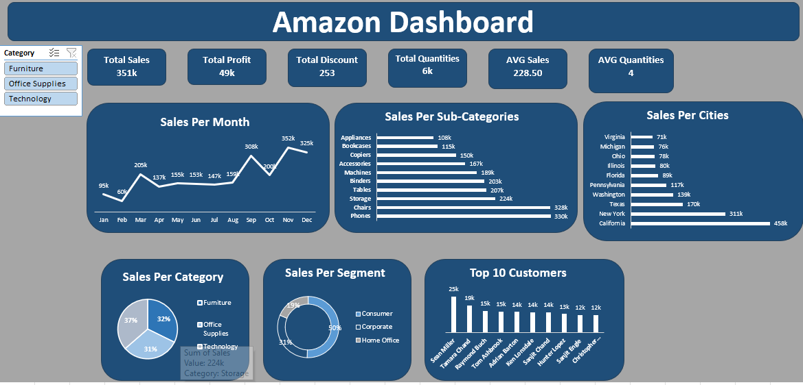

# Amazon Sales Performance Dashboard 📊

An interactive Excel dashboard designed to analyze Amazon sales data, track key performance indicators (KPIs), and uncover key business insights.

## 📌 Project Overview
The goal of this project is to transform raw sales data into actionable visual insights for stakeholders, helping them monitor overall revenue, top-selling categories, and city-level performance.

## 🛠️ Tools & Skills Used
- **Tool:** Microsoft Excel
- **Features Used:** Pivot Tables, Data Cleansing, Data Visualization, Slicers, KPI Cards.
- **Design:** Modern dark-blue & light-gray theme with strong color contrast for improved readability.

## 📸 Dashboard Preview

## 💡 Key Insights
- **Top Performing State/City:** California generated the highest sales ($458k).
- **Sales Trends:** Sales peaked significantly toward November and December ($552k and $325k).
- **Product Categories:** Technology and Furniture form the majority of total revenue.
